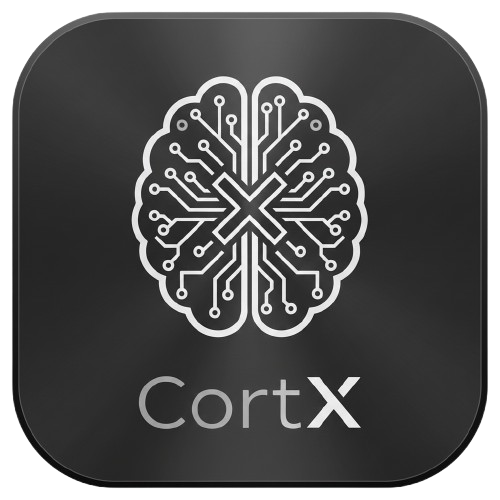
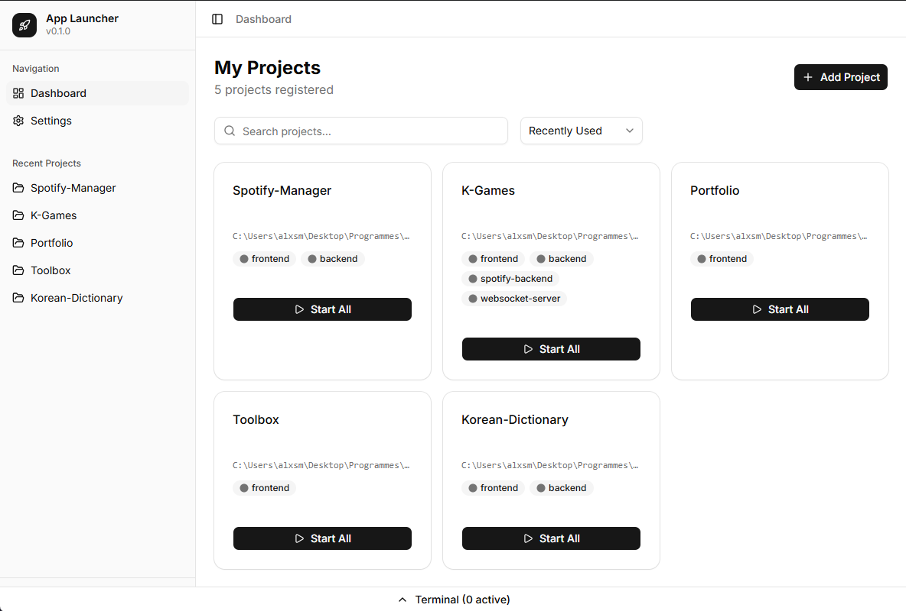
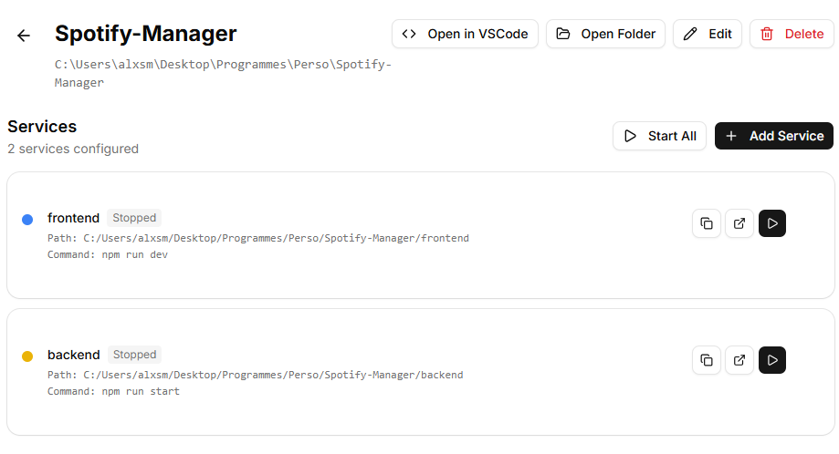
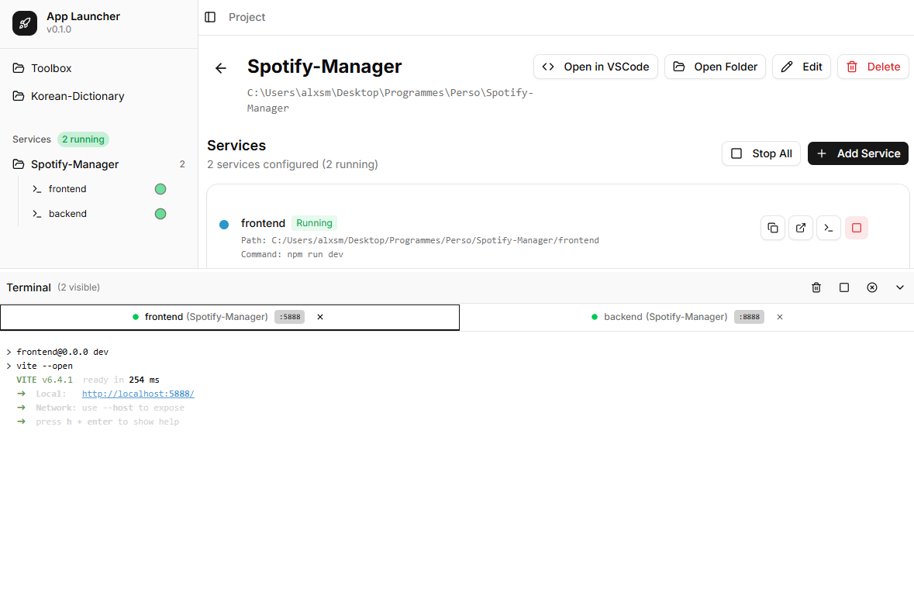
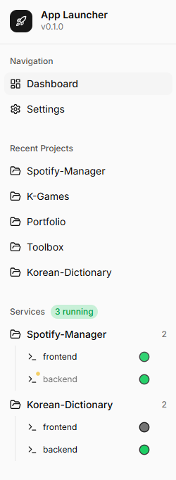
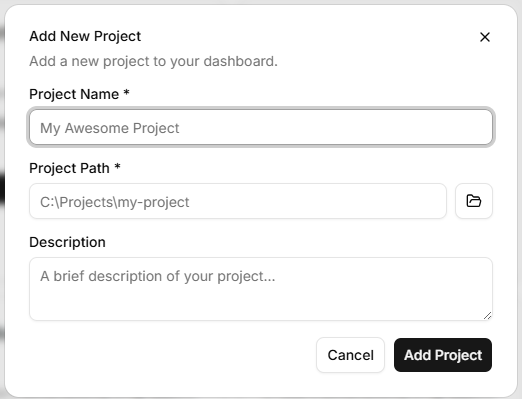
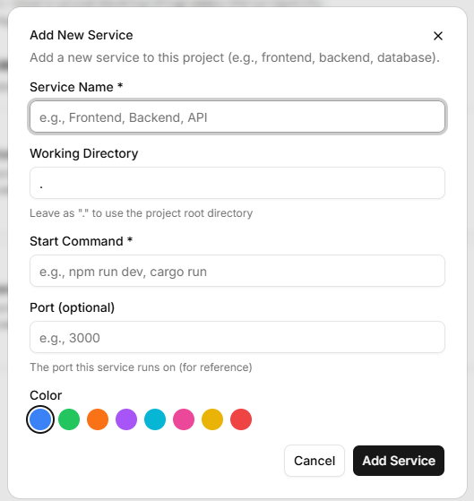

# CortX

One brain for all your builds



CortX is a modern desktop application for managing and launching your local development projects. Stop juggling multiple terminal windows, organize all your services in one place and launch them with a single click.



## Why CortX?

Modern development often involves running multiple services simultaneously, a frontend dev server, a backend API, a database, maybe some workers. CortX solves the chaos of managing these by providing:

- **One-click project launch** - Start all your services together
- **Integrated terminal** - View logs from all services in tabbed terminals
- **Service monitoring** - See at a glance what's running and on which port
- **Quick actions** - Open projects in VSCode or file explorer instantly

## Platforms

CortX is built with [Tauri](https://tauri.app/), making it lightweight and secure. It currently supports Windows only, with plans for macOS and Linux in future releases.

## Features

### Project Management

Create projects that group related services together. Each project points to a root directory and contains multiple services that can be started individually or all at once.



### Integrated Terminal

View real-time logs from all your running services in a resizable terminal panel. Features include:

- **Tabbed interface** - Switch between service logs easily
- **Clickable URLs** - Links in terminal output open in your browser
- **Auto-scroll** - Follows new output, pauses when you scroll up
- **Port detection** - Automatically detects and displays running ports



### Service Controls

Full control over your services from the sidebar:

- Start/Stop individual services
- Start All/Stop All per project
- Close terminals when done
- Visual status indicators (running, stopped, starting)



### Quick Actions

- **Open in VSCode** - Launch your project directly in VS Code
- **Open Folder** - Quick access to file explorer
- **Copy commands** - Get the launch command to run elsewhere

## Installation

### Download

Download the latest release for your platform from the [Releases](https://github.com/ALXS-GitHub/CortX/releases) page.

### Build from Source

Requirements:
- [Bun](https://bun.sh/) (recommended) or [Node.js](https://nodejs.org/) 18+
- [Rust](https://www.rust-lang.org/tools/install) 1.70+

**Using Bun (recommended):**

```bash
# Clone the repository
git clone https://github.com/ALXS-GitHub/CortX.git
cd CortX/frontend

# Install dependencies
bun install

# Run in development mode
bun tauri:dev

# Build for production
bun tauri:build
```

**Using npm (alternative):**

```bash
# Clone the repository
git clone https://github.com/ALXS-GitHub/CortX.git
cd CortX/frontend

# Install dependencies
npm install

# Run in development mode
npm run tauri:dev

# Build for production
npm run tauri:build
```

## Usage

### Creating a Project

1. Click the **"New Project"** button on the dashboard
2. Enter a name and description for your project
3. Select the root directory (where your project files are located)
4. Click **Create**



### Adding Services

1. Open a project by clicking on its card
2. Click **"Add Service"**
3. Configure the service:
   - **Name** — A friendly name (e.g., "Frontend", "API Server")
   - **Command** — The command to run (e.g., `npm run dev`, `python manage.py runserver`)
   - **Working Directory** — Relative path from project root (optional)
   - **Environment Variables** — Any env vars needed (optional)
4. Click **Save**



### Running Services

**Start a single service:**
- Click the **Play** button next to the service

**Start all services in a project:**
- Click **"Start All"** in the project view, or
- Click the **"Start All"** button on the project card

**Stop services:**
- Click the **Stop** button next to a running service, or
- Use **"Stop All"** to stop all services in a project

### Viewing Logs

The terminal panel at the bottom shows output from all running services:

- Click a tab to switch between services
- The panel auto-scrolls to show new output
- Scroll up to pause auto-scroll (scroll to bottom to resume)
- Click any URL in the output to open it in your browser
- Detected ports are shown as badges in the tab

**Resize the terminal:**
- Drag the top edge of the terminal panel up or down

**Minimize the terminal:**
- Click the minimize button to collapse it to a thin bar

### Settings

Access settings from the sidebar to configure:

- **Default terminal** - Choose between integrated or external terminal
- **Theme** - Light or dark mode

## Tech Stack

- **[Tauri v2](https://tauri.app/)** - Rust-based desktop app framework
- **[React 19](https://react.dev/)** - UI framework
- **[TypeScript](https://www.typescriptlang.org/)** - Type safety
- **[Tailwind CSS](https://tailwindcss.com/)** - Styling
- **[shadcn/ui](https://ui.shadcn.com/)** - UI components
- **[Zustand](https://zustand-demo.pmnd.rs/)** - State management

## License

MIT License - see [LICENSE](LICENSE) for details.

## Author

[ALXS-GitHub](https://github.com/ALXS-GitHub)

---

<p align="center">
  Made with Tauri + React
</p>
