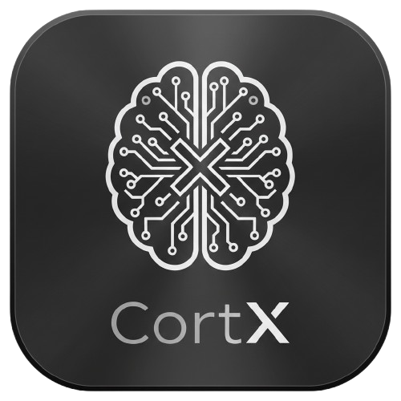
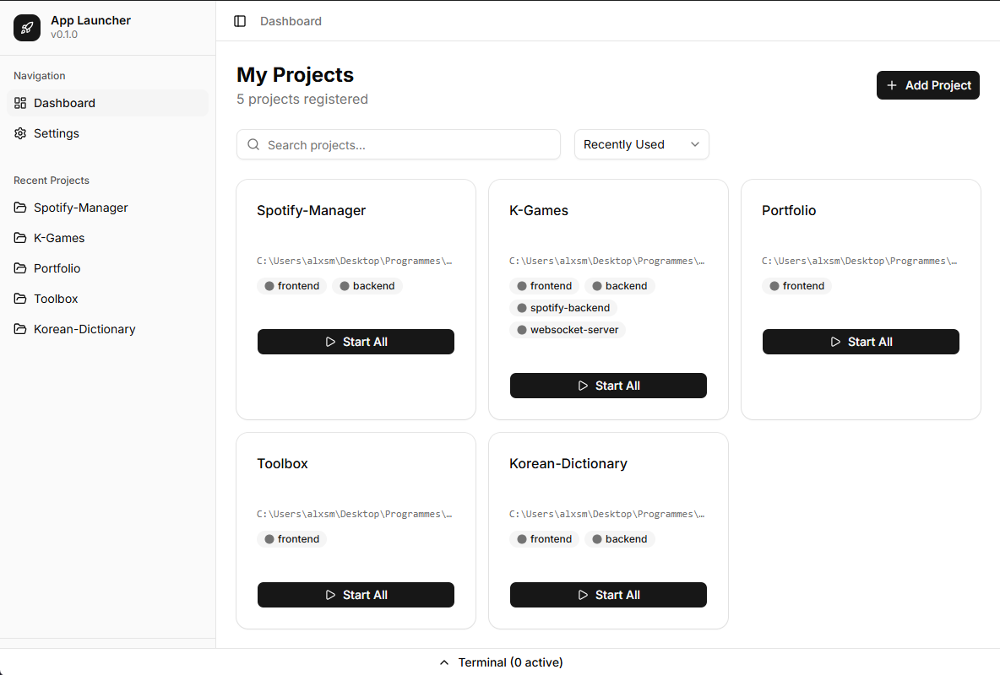
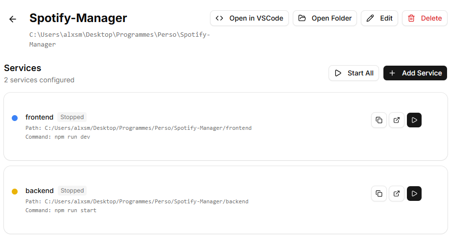
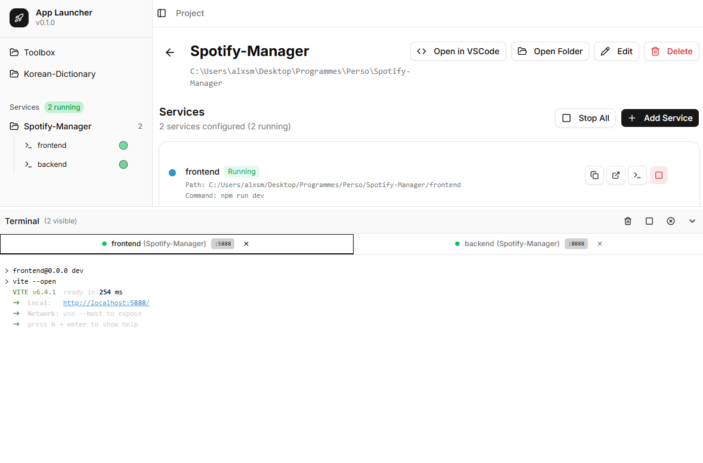
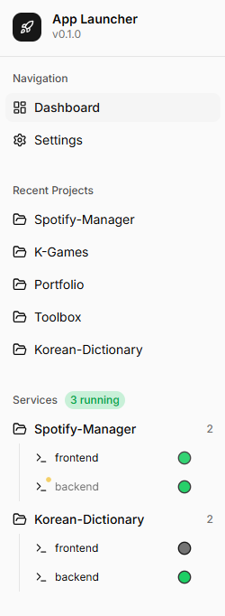
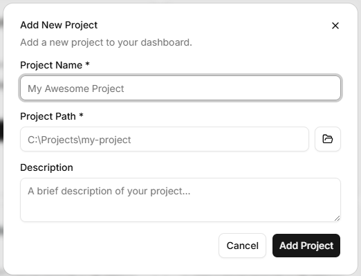
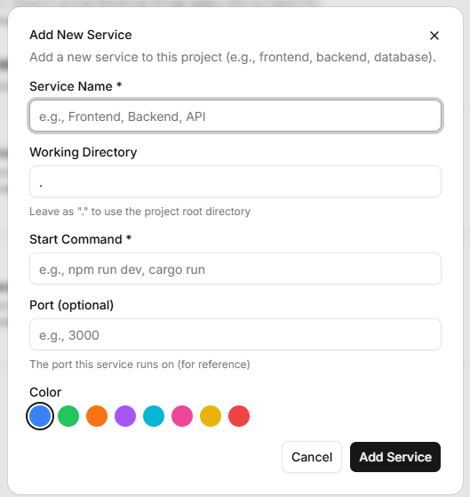

# CortX

One brain for all your builds



CortX is a modern desktop application for managing and launching your local development projects. Stop juggling multiple terminal windows, organize all your services in one place and launch them with a single click.



## Why CortX?

Modern development often involves running multiple services simultaneously, a frontend dev server, a backend API, a database, maybe some workers. CortX solves the chaos of managing these by providing:

- **One-click project launch** - Start all your services together
- **Integrated terminal** - View logs from all services in tabbed terminals
- **Service monitoring** - See at a glance what's running and on which port
- **Quick actions** - Open projects in VSCode or file explorer instantly

## Platforms

CortX is built with [Tauri](https://tauri.app/), making it lightweight and secure. Builds are produced for:

- **Windows** (x86_64) — `.msi` and `.exe` (NSIS) installers
- **macOS** (Apple Silicon and Intel) — `.dmg`
- **Linux** (x86_64) — `.deb` and `.AppImage`

Pre-built artifacts for all three platforms are attached to each [release](https://github.com/ALXS-GitHub/CortX/releases).

## Features

### Project Management

Create projects that group related services together. Each project points to a root directory and contains multiple services that can be started individually or all at once.



### Integrated Terminal

Every service, script and shell tab runs in a real terminal (a PTY rendered with xterm.js), not a log viewer. Features include:

- **Real terminal** - Colors, progress bars, interactive prompts and TUIs behave exactly as in a standalone terminal; type into any tab to answer a prompt
- **Inline images** - Sixel and iTerm2 (`imgcat`-style) images render in place, on Windows too
- **Shell tabs** - Open a shell in the current project with the `+` button; pick the shell in Settings
- **Shell integration** - With `cortx init` in your profile, tabs follow the shell's current directory, show a spinner while a command runs and a result pill (ok / exit code) when a command finished while you were looking elsewhere. Long commands that end in a background tab raise a toast, and an OS notification when CortX is not focused. Every finished command is appended to a cross-terminal history
- **Terminal window** - A dedicated window for real terminal work: sessions grouped by project in a rail, a Global / project scope switcher, tabs with splits (right / down), rename, pin and colour, a status bar with the live directory and command state. Open it from the dock (window icon), move any dock tab into it, send a pane back to the dock, or run `cortx terminal [--project <name>]` from any shell
- **Session restore** - Quit and come back: the Terminal window reopens with the same tabs and splits, each shell in the directory it was in, with the tail of its previous output above a "restored session" rule. Nothing is re-run. Services and scripts show as ended with a Restart button. Everything lives in `data/terminal/sessions.json`, synced by the git backup
- **Launch configurations** - Presets that open a set of terminals for a project — tabs, splits, a directory and an optional command for each — from the project page ("Open a dev session"), the Terminal window, the command palette or `cortx terminal --layout <name>`. Save the current window as one, edit them as a form or as YAML in Settings
- **Tabbed interface** - Switch between tabs, split into panes, hide tabs without stopping the process
- **Clickable URLs** - Links in terminal output open in your browser
- **Port detection** - Automatically detects and displays running ports



### Service Controls

Full control over your services from the sidebar:

- Start/Stop individual services
- Start All/Stop All per project
- Close terminals when done
- Visual status indicators (running, stopped, starting)



### Quick Actions

- **Open in VSCode** - Launch your project directly in VS Code
- **Open Folder** - Quick access to file explorer
- **Copy commands** - Get the launch command to run elsewhere

## Installation

### Download

Download the latest release for your platform from the [Releases](https://github.com/ALXS-GitHub/CortX/releases) page.

### Build from Source

Requirements:
- [Bun](https://bun.sh/) (recommended) or [Node.js](https://nodejs.org/) 18+
- [Rust](https://www.rust-lang.org/tools/install) 1.70+

**Using Bun (recommended):**

```bash
# Clone the repository
git clone https://github.com/ALXS-GitHub/CortX.git
cd CortX/frontend

# Install dependencies
bun install

# Run in development mode
bun tauri:dev

# Build for production
bun tauri:build
```

**Using npm (alternative):**

```bash
# Clone the repository
git clone https://github.com/ALXS-GitHub/CortX.git
cd CortX/frontend

# Install dependencies
npm install

# Run in development mode
npm run tauri:dev

# Build for production
npm run tauri:build
```

## Usage

### Creating a Project

1. Click the **"New Project"** button on the dashboard
2. Enter a name and description for your project
3. Select the root directory (where your project files are located)
4. Click **Create**



### Adding Services

1. Open a project by clicking on its card
2. Click **"Add Service"**
3. Configure the service:
   - **Name** — A friendly name (e.g., "Frontend", "API Server")
   - **Command** — The command to run (e.g., `npm run dev`, `python manage.py runserver`)
   - **Working Directory** — Relative path from project root (optional)
   - **Environment Variables** — Any env vars needed (optional)
4. Click **Save**



### Running Services

**Start a single service:**
- Click the **Play** button next to the service

**Start all services in a project:**
- Click **"Start All"** in the project view, or
- Click the **"Start All"** button on the project card

**Stop services:**
- Click the **Stop** button next to a running service, or
- Use **"Stop All"** to stop all services in a project

### Viewing Logs

The terminal panel at the bottom shows output from all running services:

- Click a tab to switch between services
- The panel follows new output; scroll up to read back, scroll down to resume
- Type in a tab to send keystrokes to the process (answer `y/n` prompts, use `Ctrl+C`)
- Select text and press `Ctrl+C` (or `Ctrl+Shift+C`) to copy; `Ctrl+V` or right-click to paste
- Click any URL in the output to open it in your browser
- Detected ports are shown as badges in the tab
- Stopping a service sends `Ctrl+C` first so dev servers shut down cleanly, then kills what's left

**Resize the terminal:**
- Drag the top edge of the terminal panel up or down

**Minimize the terminal:**
- Click the minimize button to collapse it to a thin bar

### Settings

Access settings from the sidebar to configure:

- **Default terminal** - Choose between integrated or external terminal
- **Integrated terminal shell** - Command line of the shell used by "new terminal" tabs (auto-detects PowerShell 7 / `$SHELL`)
- **Shell integration & notifications** - Turn the OSC 7 / OSC 133 block of `cortx init` on or off, and choose whether long commands notify you and from how many seconds
- **Appearance** - Light / dark / system mode, plus the style: *Halcyon* (the default look, shared with Zorg) or *Classic* (the previous neutral shadcn theme). Accent colour and font are adjustable in both styles; corner radius in Halcyon

## Tech Stack

- **[Tauri v2](https://tauri.app/)** - Rust-based desktop app framework
- **[React 19](https://react.dev/)** - UI framework
- **[TypeScript](https://www.typescriptlang.org/)** - Type safety
- **[Tailwind CSS](https://tailwindcss.com/)** - Styling
- **[shadcn/ui](https://ui.shadcn.com/)** - UI components
- **[Zustand](https://zustand-demo.pmnd.rs/)** - State management

## License

MIT License - see [LICENSE](LICENSE) for details.

## Author

[ALXS-GitHub](https://github.com/ALXS-GitHub)

---

<p align="center">
  Made with Tauri + React
</p>
